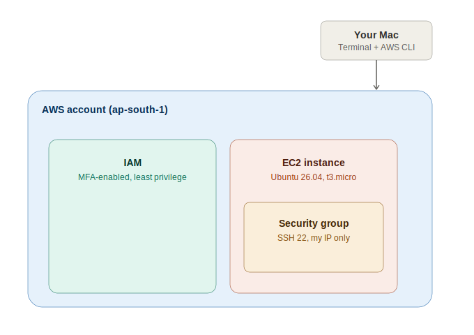

# Project 01 — Cloud Foundations

## Objective
Set up a properly secured AWS account foundation least-privilege IAM access, CLI authentication, and cost controls then provision, connect to, and maintain a Linux server (EC2) using the same practices a production environment would require. The goal was not just to launch a server, but to understand why each security and operational decision matters, and to be able to debug real AWS errors independently.

## Topics Covered
- IAM (root account hardening, least-privilege user creation, policy attachment)
- AWS CLI installation and authentication
- EC2 (AMIs, instance types, security groups, key pairs)
- Regional architecture in AWS (why AMIs are region-specific)
- SSH (key-based authentication to a remote Linux host)
- Linux server administration (`apt update/upgrade`, kernel management, reboot handling)
- Cost hygiene (identifying and terminating unused resources)
- Systems recon (`hostnamectl`, `df -h`, `free -h`) and interpreting virtualization at the OS level

## Architecture

## Engineering Decision Board

| Decision | Options Considered | Choice Made | Reasoning |
|---|---|---|---|
| Daily-use identity | Root account vs IAM user | IAM user (`Sakshi-admin`) with MFA | Root has unrestricted access to billing and account deletion; using it daily violates least-privilege |
| Region | `us-east-1` (default) vs `ap-south-1` | `ap-south-1` | Lower latency from India; chosen intentionally, not left as default |
| SSH access rule | "Anywhere" vs "My IP" | My IP only | Restricting reduces attack surface vs opening SSH to the whole internet |
| Instance type | t2.micro vs t3.micro | t3.micro | Newer generation, still free-tier eligible, better baseline performance |
| Server updates | Skip vs run `apt update/upgrade` | Ran full update + reboot | A fresh AMI isn't pre-patched; skipping leaves known vulnerabilities |

## Implementation Steps
1. Hardened AWS root account: enabled MFA, avoided root access keys
2. Set a billing budget with alerts
3. Created IAM user `Sakshi-admin` with `AdministratorAccess`, console access, MFA
4. Installed AWS CLI, ran `aws configure`, verified identity with `aws sts get-caller-identity`
5. Launched EC2 instance (Ubuntu, t3.micro) in `ap-south-1`, SSH restricted to my IP
6. Debugged `InvalidAMIID.NotFound` by resolving a fresh AMI instead of a cached one
7. Debugged `AccessDeniedException` by checking attached IAM policies directly
8. Terminated a stray EC2 instance to avoid unnecessary billing
9. Connected via SSH (`chmod 400` on the key, then `ssh -i key.pem ubuntu@ip`)
10. Ran `apt update && apt upgrade`, handled the kernel upgrade with `sudo reboot`
11. Ran recon commands (`hostnamectl`, `df -h`, `free -h`)

## Challenges & Solutions

| Challenge | Root Cause | Solution |
|---|---|---|
| `InvalidAMIID.NotFound` on launch | Console's Quick Start tile referenced a stale AMI ID | Used "Browse more AMIs" to force a fresh, region-valid lookup |
| `AccessDeniedException` on an SSM command | IAM policy attached to wrong/mistyped username | Verified real attached policies via `aws iam list-attached-user-policies` |
| Unsure how to remove a duplicate EC2 instance | Didn't know Stop vs Terminate | Terminate deletes storage too — that's what actually stops billing |

## Lessons Learned
- AMI IDs are region- and time-specific — never assume a cached one is valid
- IAM usernames are case-sensitive; a small typo can cause silent permission failures
- Reading an AWS error message closely is usually enough to self-diagnose
- Provisioning isn't done at "it's running" — patching and reboot handling matter too

## Interview Questions
1. Why shouldn't you use the AWS root account for daily operations?
2. What is the principle of least privilege, and how did you apply it here?
3. Why are AMI IDs region-specific?
4. What's the difference between stopping and terminating an EC2 instance, cost-wise?
5. Why restrict SSH to a specific IP instead of `0.0.0.0/0`?
6. What does `chmod 400` do, and why does SSH require it?
7. Why did the server need a reboot after `apt upgrade`?
8. How would you diagnose an `AccessDeniedException` without guessing?

## Outcome
A running, updated, least-privilege-secured EC2 instance in `ap-south-1`, provisioned through documented, repeatable steps — with two real AWS errors debugged independently. This forms the compute + IAM foundation later projects will build on.
